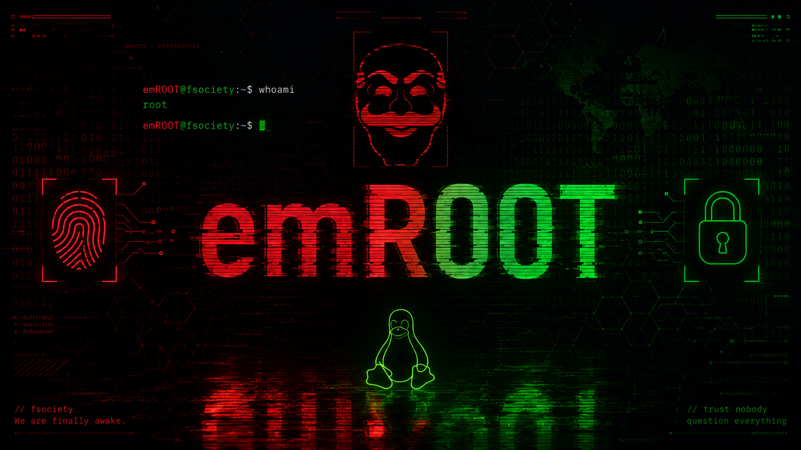
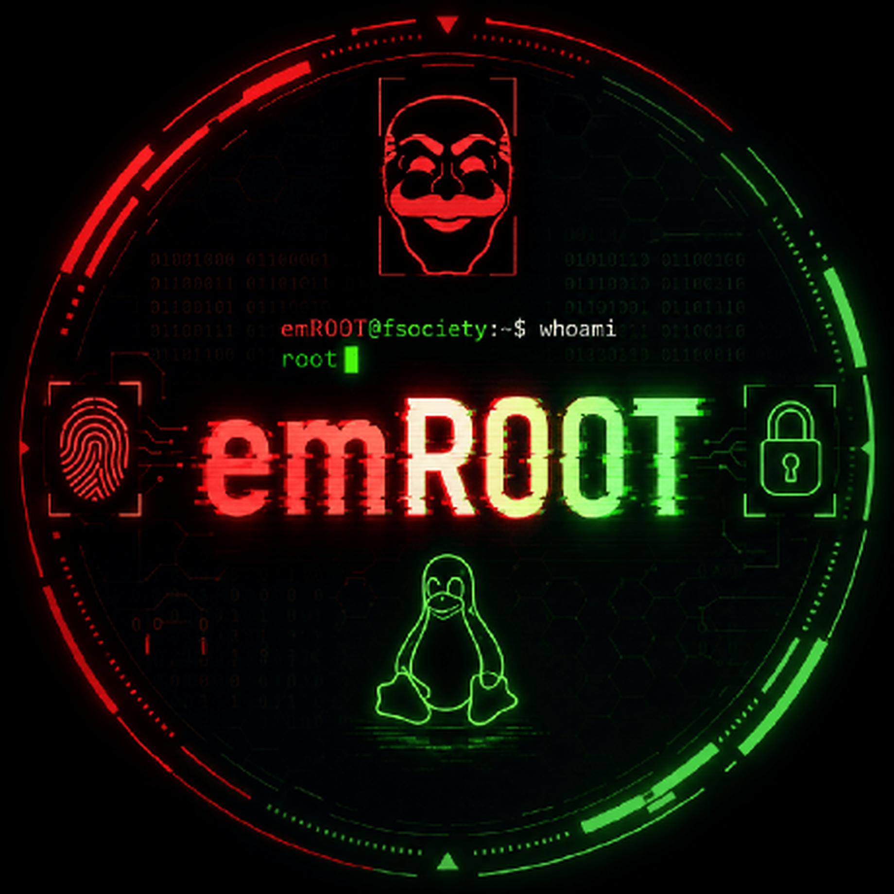

 <p align="center">
  
</p>

<h1 align="center">emR00T</h1>

<p align="center">
  <strong>Independent Developer | Linux Enthusiast | Cybersecurity</strong>
</p>

<p align="center">
  <a href="https://github.com/emR00T">
    
  </a>
  <a href="https://github.com/emR00T/emR00T-toolkit">
    
  </a>
</p>

<p align="center">
  <code>LEARN</code> • <code>BUILD</code> • <code>EXPLORE</code>
</p>

---

## `whoami`

I'm **emR00T**, an independent developer passionate about Linux, Python, system internals, and cybersecurity.

I enjoy exploring how systems work, developing my own tools, customizing Linux environments, and learning through hands-on projects.

```bash
┌──(emR00T㉿linux)-[~]
└─$ whoami
emR00T

┌──(emR00T㉿linux)-[~]
└─$ cat interests.txt
Linux & Open Source
Python & Bash
Cybersecurity
System Internals
Security Tool Development
```

## `current_focus`

* Developing **emR00T-toolkit**, a Python-based security toolkit.
* Exploring Linux internals and system customization.
* Building command-line applications with Python and Bash.
* Learning about network security and web application security.
* Experimenting with custom Linux environments.

## `featured_project`

### emR00T-toolkit

A Python-based security toolkit designed to bring together reconnaissance, web security testing, cryptographic utilities, and other security-focused modules.

<p>
  <a href="https://github.com/emR00T/emR00T-toolkit">
    
  </a>
</p>

**Repository:** [github.com/emR00T/emR00T-toolkit](https://github.com/emR00T/emR00T-toolkit)

## `tech_stack`

<p>
  
  
  
  
  
</p>

## `operating_principles`

```text
[01] Understand the system.
[02] Build your own tools.
[03] Learn by experimenting.
[04] Keep improving.
[05] Use security knowledge responsibly.
```

I believe in practical learning, curiosity, and building things that help me understand technology more deeply.

All security testing should be performed only on systems I own or have explicit permission to assess.

---

<p align="center">
  
</p>

<p align="center">
  <code>[ ACCESS GRANTED ]</code>
  <br>
  <sub>emR00T • Learn. Build. Explore.</sub>
</p>
